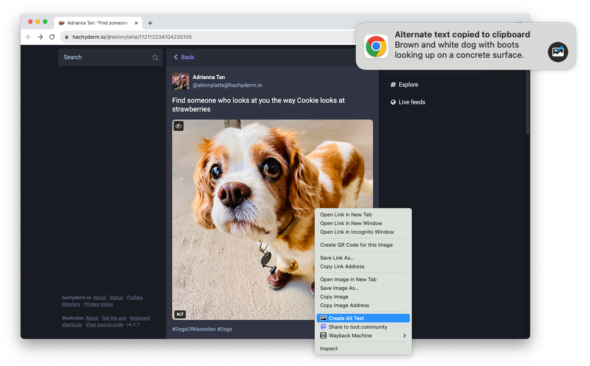

# Alt Text Creator

Alt Text Creator is a browser extension that generates [alternate text](https://en.wikipedia.org/wiki/Alt_attribute) for images using the [GPT-4 with Vision model](https://platform.openai.com/docs/guides/vision) from OpenAI. You can right-click on any image and select "Create Alt Text" to generate the text, which is then copied to your clipboard.

**You must supply your own API key from OpenAI for the extension to work.** Alt Text Creator uses the Low Resolution mode in the API and local caching to reduce the per-image processing cost. The [current pricing](https://openai.com/pricing#:~:text=Vision%20pricing%20calculator) is available on OpenAI's website.

[**Download for Google Chrome**](https://chromewebstore.google.com/detail/alt-text-creator-with-gpt/nlahkceofkdggfgfpheakpaphdfplaio)

[**Download for Firefox**](https://addons.mozilla.org/en-US/firefox/addon/alt-text-creator/)

This browser extension is not affiliated with OpenAI. The icon uses images from [Bootstrap Icons](https://icons.getbootstrap.com/).
